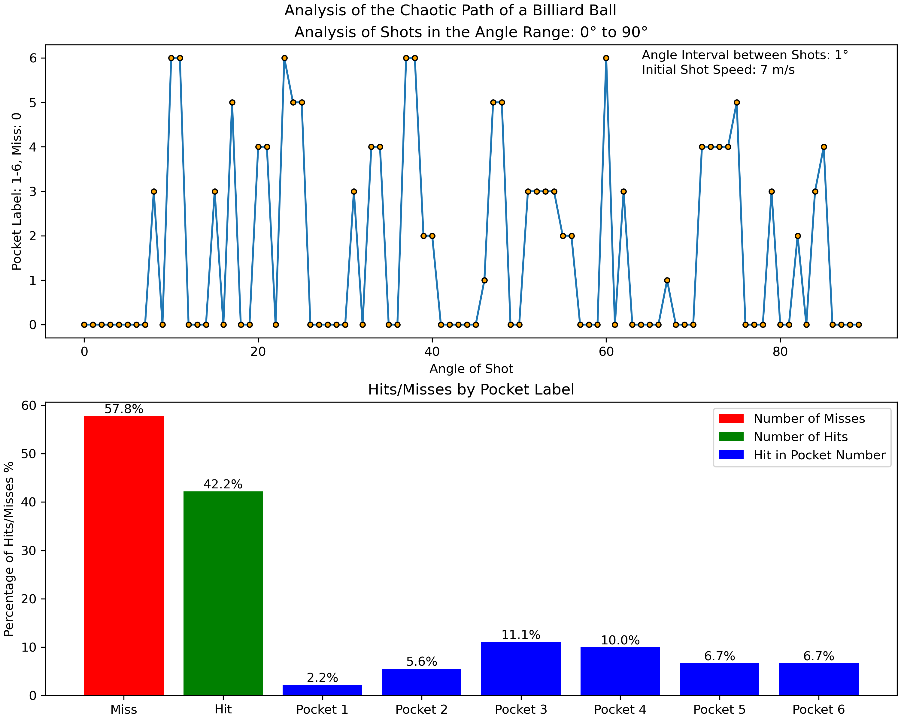
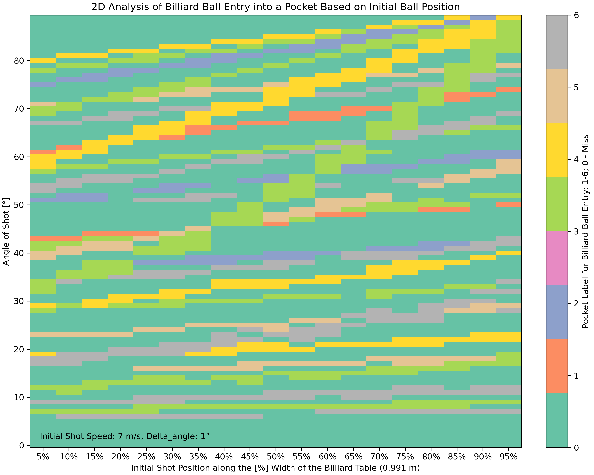
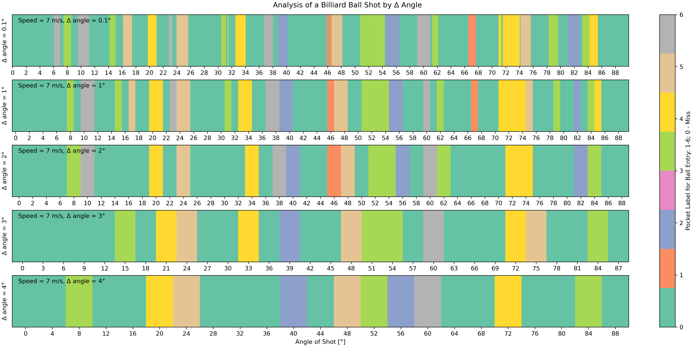
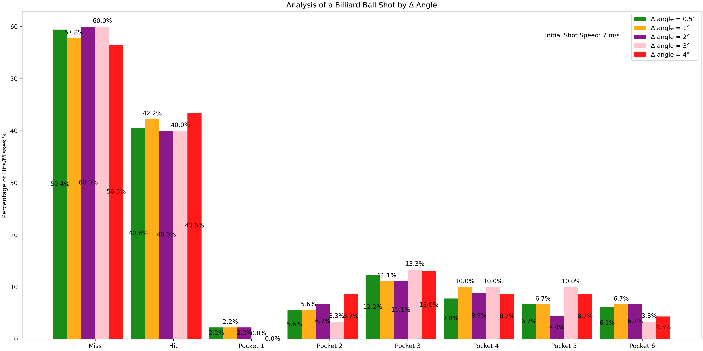

# Billiard Ball Impact Study

**Investigating the Complex Behavior of Billiard Ball Impacts on Walls**






## Overview

The "Billiard Ball Impact Study" project is dedicated to exploring the intricate and often unpredictable behavior that occurs when a billiard ball strikes a wall. The impact of the ball on the wall can be influenced by various factors, including the angle of incidence, the speed of the ball, and the properties of the ball and wall surfaces. This project employs Python libraries for data analysis and visualization.

## Required Libraries

Before delving into the project, ensure you have the following Python libraries and dependencies installed:

- [NumPy](https://numpy.org/): A library for numerical computations.
- [SciPy](https://www.scipy.org/): A library for scientific and technical computing.
- [Matplotlib](https://matplotlib.org/): A library for creating visualizations.

You can install these libraries using `pip` or your preferred package manager:

```bash
pip install numpy scipy matplotlib
